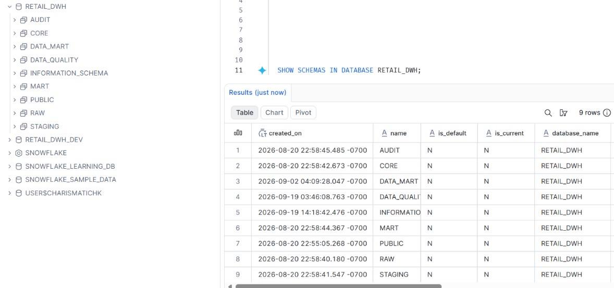
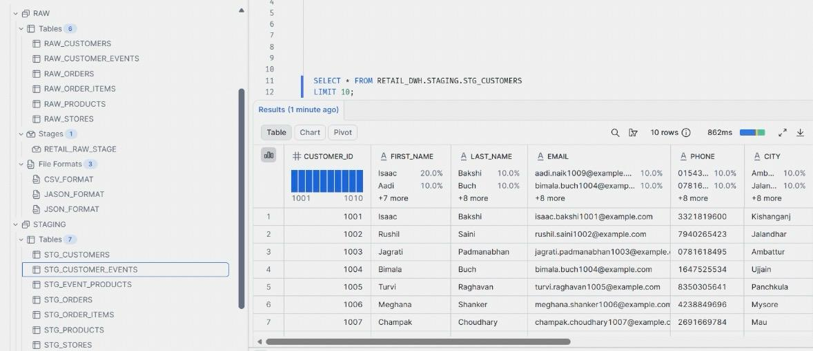
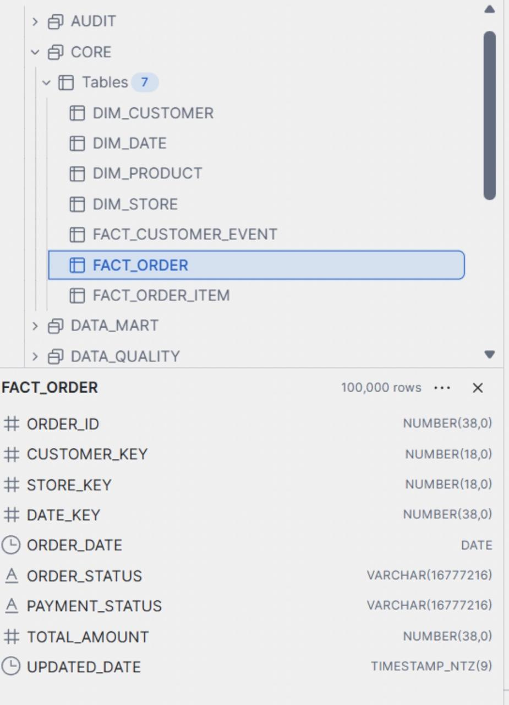
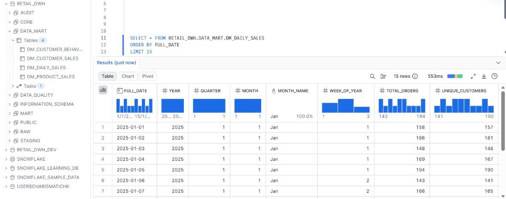
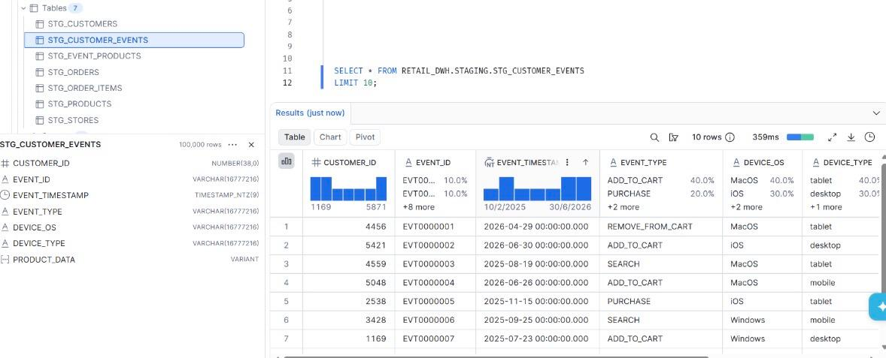
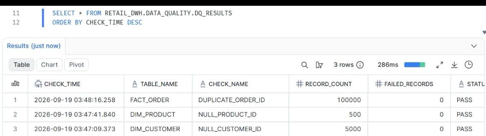
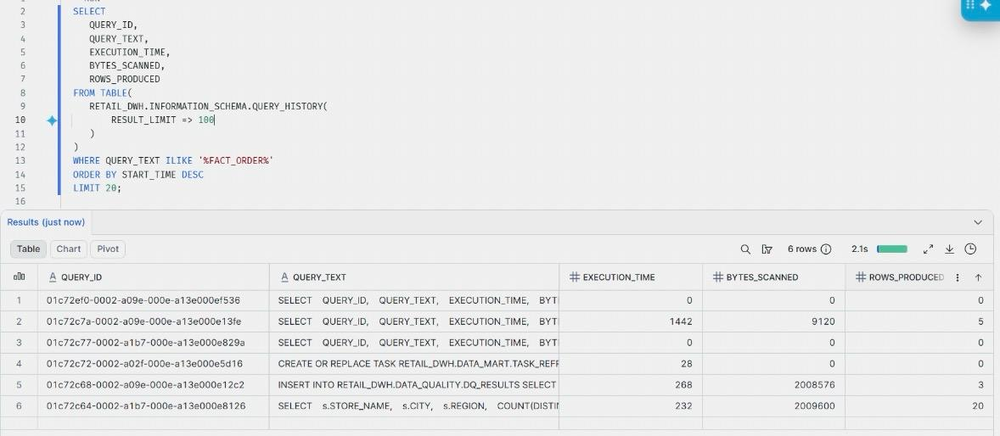

##Snowflake Retail Data Warehouse

An end-to-end retail data warehouse built using Snowflake SQL and Python.

The project demonstrates how structured CSV data and semi-structured JSON customer events can be ingested, transformed, modeled and exposed through analytical data marts.

##Project Overview

This project simulates a retail analytics platform built on Snowflake.

The objective was to create a centralized analytical warehouse capable of supporting:

- Sales analysis
- Product performance analysis
- Customer analytics
- Store performance
- Customer behavior analysis
- Data quality monitoring

##Problem Statement

Retail data is often distributed across multiple source systems and formats.

This project addresses the challenge of integrating:

- Structured CSV datasets
- Semi-structured JSON customer events

into a centralized Snowflake data warehouse.

The solution uses a layered architecture to separate ingestion, transformation, dimensional modeling and analytics.

##Architecture

Python
   |
   v
CSV / JSON
   |
   v
Snowflake Stage
   |
   v
RAW
   |
   v
STAGING
   |
   v
CORE
   |
   v
DATA MART
   |
   v
Analytics

Technology Stack

* Snowflake
* SQL
* Python
* Pandas
* NumPy
* Faker
* JSON
* Snowflake VARIANT
* Snowflake Streams
* Snowflake Tasks
* Time Travel
* Zero-Copy Cloning

##Dataset

The project uses synthetic retail data generated using Python.

Dataset           Records
Customers         5,000
Products          500
Stores            20
Orders            100,000
Order Items       300,791
Customer Events   100,000

##Data Architecture

-RAW
Stores source data before transformation.

-STAGING
Performs data standardization, validation and JSON parsing.

-CORE
Implements a Star Schema.

Dimensions
* DIM_CUSTOMER
* DIM_PRODUCT
* DIM_STORE
* DIM_DATE

Facts
* FACT_ORDER
* FACT_ORDER_ITEM
* FACT_CUSTOMER_EVENT

-DATA MART
Business-focused analytical tables:

* DM_DAILY_SALES
* DM_PRODUCT_SALES
* DM_CUSTOMER_SALES
* DM_CUSTOMER_BEHAVIOR

##JSON Processing
Customer event data is stored as semi-structured JSON and processed using Snowflake VARIANT functionality.

Nested attributes such as:
* Device information
* Product information
* Event metadata
are extracted into relational staging structures.

##Analytics
The project includes analytical SQL using:

* CTEs
* Window Functions
* LAG()
* RANK()
* QUALIFY
* CASE expressions
* Aggregations

Example analyses include:
* Monthly sales
* Month-over-month growth
* Top products
* Top customers
* Store performance
* Customer behavior
* Device behavior
* Event analysis

##Data Quality
A dedicated DATA_QUALITY schema was created to support validation checks.

Checks include:
* Null validation
* Duplicate detection
* Record count validation
* Missing dimension key checks

##Snowflake Features Demonstrated

-Streams
Used to demonstrate change data capture capabilities on staging data.

-Tasks
Used to demonstrate scheduled warehouse processing.

-Time Travel
Used to demonstrate historical data access.

-Zero-Copy Cloning
Used to demonstrate creating a development copy of the warehouse without physically duplicating the underlying data.

-Query History
Used to inspect query execution and performance-related metadata.

##Repository Structure
retail-snowflake-data-warehouse/
│
├── README.md
├── sql/
├── python/
├── docs/
└── screenshots/

Project Outcome
The project resulted in a layered Snowflake analytical warehouse integrating structured and semi-structured retail data.

It provides reusable dimensional models and analytical data marts for sales, product, customer and behavioral analysis.

Author
Harsh Khandelwal

## Project Screenshots

###1. Snowflake Database Architecture

###2. RAW and STAGING Layers

###3. CORE Star Schema

###4. Analytical Data Marts

###5. JSON / VARIANT Processing

###6. Data Quality Framework

###7. Query History

